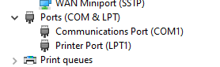
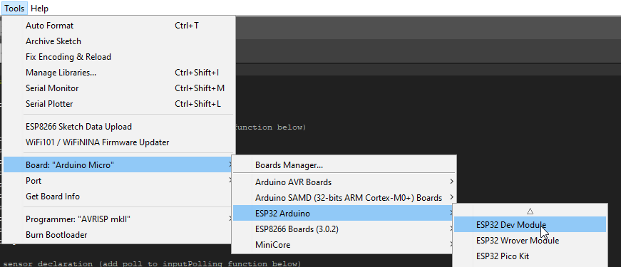
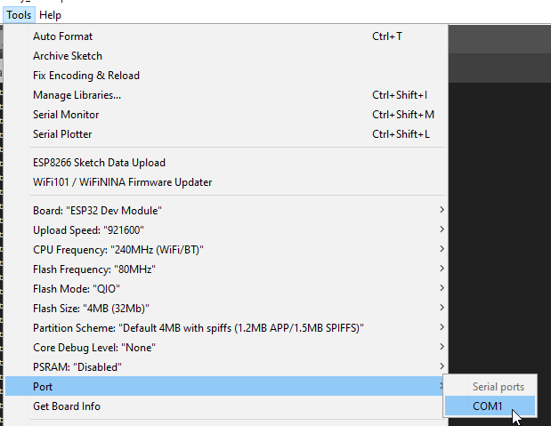
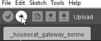
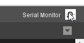
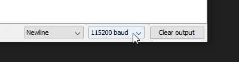

Library for creating Arduino home automation applications on the [nbTec houseCat ESP32 powered centralized home automation controller](https://nbtec.be/en/product/housecat-esp32-home-automation-gateway/).

*   [Programming](#Programming)
    *   [Protocol](#Protocol)
        *   [Modbus](#Modbus)
        *   [MQTT](#MQTT)
        *   [UDP](#UDP)
            *   [Inputs](#Inputs)
            *   [Ouputs](#Ouputs)
            *   [Analog outputs](#Analogoutputs)
        *   [Inputs](#Inputs.1)
        *   [Button](#Button)
            *   [Modbus Readout](#ModbusReadout)
            *   [MQTT Readout](#MQTTReadout)
        *   [Sensor](#Sensor)
            *   [Modbus Readout](#ModbusReadout.1)
            *   [MQTT Readout](#MQTTReadout.1)
    *   [Outputs](#Outputs)
        *   [Relay](#Relay)
            *   [Modbus Control](#ModbusControl)
            *   [MQTT Control](#MQTTControl)
        *   [Blind](#Blind)
            *   [Modbus Control](#ModbusControl.1)
            *   [MQTT Control](#MQTTControl.1)
    *   [Analog Outputs](#AnalogOutputs)
        *   [Dimmer](#Dimmer)
            *   [Modbus Control](#ModbusControl.2)
            *   [MQTT Control](#MQTTControl.2)


Programming
===========

*   Download and install the Arduino IDE
    *   [https://www.arduino.cc/en/software](https://www.arduino.cc/en/software)
*   Install the houseCat library together with the following libraries
    *   [https://github.com/nbTec/houseCat-Arduino-Library](https://github.com/nbTec/houseCat-Arduino-Library)
    *   [https://github.com/emelianov/modbus-esp8266](https://github.com/emelianov/modbus-esp8266)
    *   [https://github.com/256dpi/arduino-mqtt](https://github.com/256dpi/arduino-mqtt)
*   Power the Housecat and connect the USB port to your computer
*   Wait for the (FTDI) driver installation to complete
*   The COM port should appear in device manager

*   *   
*   Start the arduino IDE
*   Open File → Preferences
*   Add the following url to "Addition Boards Manager URLs"
    *   [https://raw.githubusercontent.com/espressif/arduino-esp32/gh-pages/package\_esp32\_index.json](https://raw.githubusercontent.com/espressif/arduino-esp32/gh-pages/package_esp32_index.json)
*   Click OK
*   Open Tools → Boards → Boards Manager...
*   Find "esp32" and click install
*   After installation close the Boards Manager
*   Select the following Board
    *   
*   Select the Port that came up in device manager after connecting the Housecat earlier
    *   
*   Open your project "\_housecat\_gateway.ino"
*   Click the program button
    *   
    *   The program will now be compiled and uploaded to Housecat
*   You can click the serial monitor button to see debug output
    *   
    *   Make sure to set the baudrate to 115200
    *   

Protocol
--------

For the time being, one out of three protocols can be enabled for use over the ethernet/wifi interface.

### Modbus

```cpp
hc.modbusEnable();
```

### MQTT

```cpp
hc.mqttEnable();
hc.mqttSetBaseTopic("housecat");
hc.mqttSetBroker(IPAddress(192, 168, 1, 101), 1883);
hc.mqttSetBrokerCredentials("user", "password");
```

### UDP

```cpp
hc.udpEnable();
hc.udpSetAddress(1);   
hc.udpSetReceiver(55555); hc.udpSetSender(IPAddress(192, 168, 1, 101), 44444);
```

Enabling UDP initiates raw control of inputs/outputs and analog outputs (see houseCat\_UDP example).  
By sending strings to the receive port which is set by udpSetReceiver, the outputs and analog outputs can be controlled.  
Changes on the inputs will be sent to the IP address and port set by udpSetSender.  
The strings use spaces as a delimiter between variables.

#### Inputs

```cpp
housecat1 din64 0
housecat1 din64 1
```

*   housecat1: Housecat prefix together with the address set by udpSetAddress
*   din: Digital input identifier
*   64: Digital input number (1 to 64)
*   0/1: Input state (0: low, 1: high)

#### Ouputs

```cpp
housecat1 dout64 0
housecat1 dout64 1
```

*   housecat1: Housecat prefix together with the address set by udpSetAddress
*   dout: Digital output identifier
*   64: Digital output number (1 to 64)
*   0/1: Output state (0: low, 1: high)

#### Analog outputs

```cpp
housecat1 aout8 0
housecat1 aout8 255
```

*   housecat1: Housecat prefix together with the address set by udpSetAddress
*   aout: Analog output identifier
*   8:  Analog output number (1 to 8)
*   0 to 255: Output level (0: 0V, 255: 10V)

### Inputs

### Button

**Declaration**

```cpp
housecatInputButton button_name(input_number);
```

Used to generate short/long press signals when a button is connected to an input.

**Polling**

```cpp
button_name.poll();
```

Add these for all your buttons into the inputPolling() function, this way the corresponding input pin will be monitored and short/long press signals will be generated.

**Properties**

```cpp
button_name.shortPress();
button_name.longPress();
```

These boolean outputs can be used at any location in your code, for example inside a housecatOutputRelay poll function in order to toggle an output following a short button press.  
The longPress() output will remain high as long as the button is pressed.

#### Modbus Readout

Short press status is linked to a discrete input, the address is the input\_number used in the creation of the button.  
Long press status has an offset of 64 to the short press address.

#### MQTT Readout

Short or long press states (FALSE: off, TRUE: on) are published to the following channel patterns.

```cpp
/housecat/input/64/button/short/
/housecat/input/64/button/long/
```

*   64: Input number (1 to 64)

### Sensor

**Declaration**

```cpp
housecatInputSensor sensor_name(input_number, active_state);
```

Used to generate a pulse signal when for example a motion sensor is connected to an input, active\_state represents the state signal of the sensor when active (LOW or HIGH).

**Polling**

```cpp
sensor_name.poll();
```

Add these for all your sensors into the inputPolling() function, this way the corresponding input pin will be monitored and pulse signals will be generated.

**Properties**

```cpp
button_name.pulse();
```

This boolean output can be used at any location in your code, for example inside a housecatOutputRelay poll function in order to toggle an output following a sensor pulse.

#### Modbus Readout

Sensor status is linked to a discrete input, the address is the input\_number used in the creation of the sensor.

#### MQTT Readout

The state of the sensor (FALSE: off, TRUE: on) is published to the following channel pattern.

```cpp
/housecat/input/64/sensor/
```

*   64: Input number (1 to 64)

Outputs
-------

### Relay

**Declaration**

```cpp
housecatOutputRelay relay_name(output_number);
```

Used to control a relay that is connected to a digital output.

**Configuration**

```cpp
relay_name.enableAutoOff(auto_off_time_seconds);
```

Enables turning off the relay automatically after the specified time in seconds

**Configuration**

```cpp
relay_name.enableMotion(turn_on_time_seconds);
```

Sets the turn on time of the relay when using a sensor pulse input in the following poll function.

**Polling**

```cpp
relay_name.poll(buttonHallway_1.shortPress() or buttonHallway_2.shortPress());
relay_name.poll(buttonHallway_1.shortPress() or buttonHallway_2.shortPress(), buttonAllOff.longPress());
relay_name.poll(buttonHallway_1.shortPress() or buttonHallway_2.shortPress(), buttonAllOff.longPress(), buttonPanic.longPress());
relay_name.poll(buttonHallway_1.shortPress() or buttonHallway_2.shortPress(), buttonAllOff.longPress(), buttonPanic.longPress(), motionSensorHallway.pulse());
relay_name.poll(buttonHallway_1.shortPress() or buttonHallway_2.shortPress(), buttonAllOff.longPress(), false, motionSensorHallway.pulse())
```

Add these for all your relays into the outputPolling() function.

*   Parameter 1 (bool): Toggle input, you can "or" multiple inputs if the relay needs to be controlled by multiple buttons.
*   Parameter 2 (bool): Reset input, can be used for "all off" functionality.
*   Parameter 3 (bool): On input, can be used for "all on/panic" functionality.
*   Parameter 4 (bool): Sensor input, this can contain a pulse() output of a sensor mentioned earlier, a pulse on this input will turn on the relay and start the Motion timer configured earlier.
    *   Subsequent pulses will reset the timer and keep the relay turned on.

Unused parameters can be disabled using a false constant (see last example).

#### Modbus Control

Relay status is linked to a coil (0: off, 1: on), the address of the coil is the output\_number used in the creation of the relay.  
Writing to the coil will change the state of the relay.

#### MQTT Control

The state of the relay (FALSE: off, TRUE: on) is published to the following channel pattern by the Housecat on changes.  
External devices can publish TRUE or FALSE to the same topic to be able to control the relay.  
  

```cpp
/housecat/output/64/
```

*   64: Output number (1 to 64)

### Blind

**Declaration**

```cpp
housecatOutputBlinds blind_name(on_off_output_number, up_down_output_number, travel_time_seconds);
```

Used to control blinds using two relays.

```cpp
blind_name.invertDirection(true/false)
```

Inverts the up\_down output in order to correct switched wiring on the direction relay.

**Polling**

```cpp
blind_name.poll(buttonBlindUp.shortPress(), buttonBlindDown.shortPress());
```

Add these for all your blinds into the outputPolling() function.

*   Parameter 1 (bool): Blind up input
*   Parameter 2 (bool): Blind down input

You can "or" multiple inputs if the blind needs to be controlled by multiple buttons.

#### Modbus Control

Blind status is linked to a coil (0: open, 1: closed), the address of the coil is the on\_off\_output\_number used in the creation of the blind.  
Writing to the coil will change the state of the blind.

#### MQTT Control

The state of the blind is published to the following channel pattern by the Housecat on changes:

*   STOP: stopped at a certain level
*   UP: going up
*   DOWN: going down
*   OPEN: fully open
*   CLOSED: fully closed

External devices can publish to the same topic to be able to control the blind.

*   STOP: stop at a certain level
*   UP: start going up
*   DOWN: start going down

```cpp
/housecat/output/64/
```

*   64: Output number (1 to 64)

Analog Outputs
--------------

### Dimmer

**Declaration**

```cpp
housecatAnalogOutputDimmer dimmer_name(analog_output_pin_number, start_percentage, default_percentage);
```

Used to control an analog output to generate 0 to 10V signals for controlling external dimmers.

**Polling**

```cpp
dimmer_name.poll(buttonLivingroomLight.shortPress(), buttonLivingroomLight.longPress());
```

Add these for all your dimmers into the outputPolling() function.

*   Parameter 1 (bool): Toggle input
*   Parameter 2 (bool): Dimmer setting input, when this input is high the dimmer setting will shift by 10% intervals.  
    *   A longPress() of a button can be used for this input.

You can "or" multiple inputs if the blind needs to be controlled by multiple buttons.

#### Modbus Control

The dimmer output state (0: disabled, 1: enabled) is linked to a coil, the address of the coil is the analog\_output\_pin\_number used in the creation of the dimmer + 64.  
Writing to the coil will change the state of the dimmer output.  
The dimmer value (0: 0V, 100: 10V) is linked to a holding register, the address of the register is the analog\_output\_pin\_number used in the creation of the dimmer.  
Writing to the register will change the state of the dimmer value.

#### MQTT Control

TRUE or FALSE corresponding to the state of the dimmer output is published to the dimmer state channel pattern by the Housecat on changes.  
External devices can publish TRUE or FALSE to the same topic to be able to control the dimmer output.  
0 (0V) to 100 (10V) corresponding to the value of the dimmer output is published to the dimmer value channel pattern by the Housecat on changes.  
External devices can publish 0 to 100 to the same topic to be able to control the dimmer value.

```cpp
/housecat/dimmer/8/state/
/housecat/dimmer/8/value/
```

*   8: Dimmer number (1 to 8)